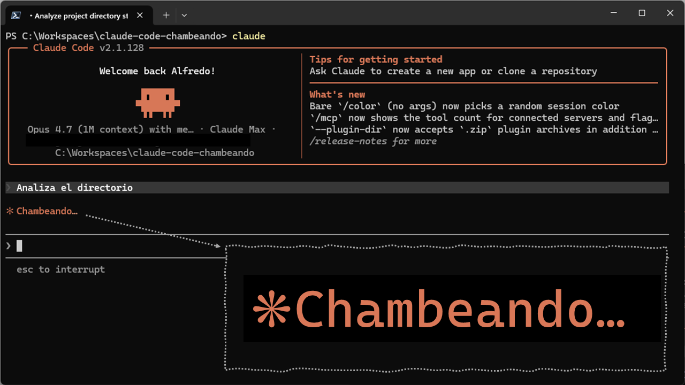

# claude-code-chambeando

Spinner verbs en español de México para Claude Code. Del comal a la consola.

Cuando Claude Code está pensando, te aparece un verbo en gerundio: *Crunching for 1m 15s*, *Pondering for 47s*. Este repo cambia esos verbos por gerundios mexicanos. *Chambeando for 1m 15s*. *Apapachando tu código*. *Itacateando dependencias*.

No es traducción. Es habla viva.

## Qué es

Una colección curada de gerundios mexicanos, organizados en paquetes por nivel de picante. Cada paquete es un archivo JSON que se instala como configuración de Claude Code.

La selección sigue criterio editorial estricto: nada de tropos corporativos ni marcas registradas. Lo que sí entra: habla viva mexicana real, construcciones juguetonas con raíces identitarias, albures suaves, guiños festivos y de cantina, títulos de canción como referencia cultural, y sabores regionales con peso cultural.

## Qué hay en esta primera edición

**Pack Jalapeño v0.2** — 165 verbos limpios aptos para cualquier sala. Cliente externo, demos formales, pantalla compartida. Distribuidos en 11 categorías culturales: Música, Gastronomía, Turismo, Deporte, Religión, Trabajo, Amistades, Naturaleza, Familia, Popular y Avance.

[Ver el pack y cómo instalarlo](packs/1-jalapeno/)

## Qué viene después

**Pack Serrano** — versión extendida del Jalapeño con verbos exclusivos de grosería afectiva mexicana y picante subido de tono. Apto solo para sesiones internas con cuates. Vendrá en una próxima edición.

**Fichas culturales** — origen, etimología y contexto cultural de cada verbo. Para quien quiera entender por qué *Apapachando* viene del náhuatl o por qué *Itacateando* es lo que tu mamá hizo cuando saliste de su casa con tupperware.

## Instalación rápida

Requiere Claude Code v2.1.23 o superior.

Edita tu `~/.claude/settings.json` y agrega el contenido de `packs/1-jalapeno/jalapeno.json`. La guía detallada está en [packs/1-jalapeno/README.md](packs/1-jalapeno/README.md).

## Manifiesto

El proyecto vive con identidad editorial clara: qué entra, qué no, y por qué. Léelo en [`docs/manifiesto.md`](docs/manifiesto.md).

## Sobre la fecha

Este repo se publica el 5 de mayo. La fecha es coincidencia oportuna y sirve para no aplazar más, pero el proyecto no celebra el Cinco de Mayo como ocasión: celebra el habla cotidiana mexicana, que no necesita una fecha para existir.

## Licencia

CC BY-NC-ND 4.0. Lo puedes compartir tal cual y darle crédito al autor, pero no usarlo comercialmente ni distribuir versiones modificadas.

## Autor

Alfredo De Regil ([@aderegil](https://github.com/aderegil))

---

claude-code-chambeando © 2026 Alfredo De Regil. Licencia CC BY-NC-ND 4.0.
